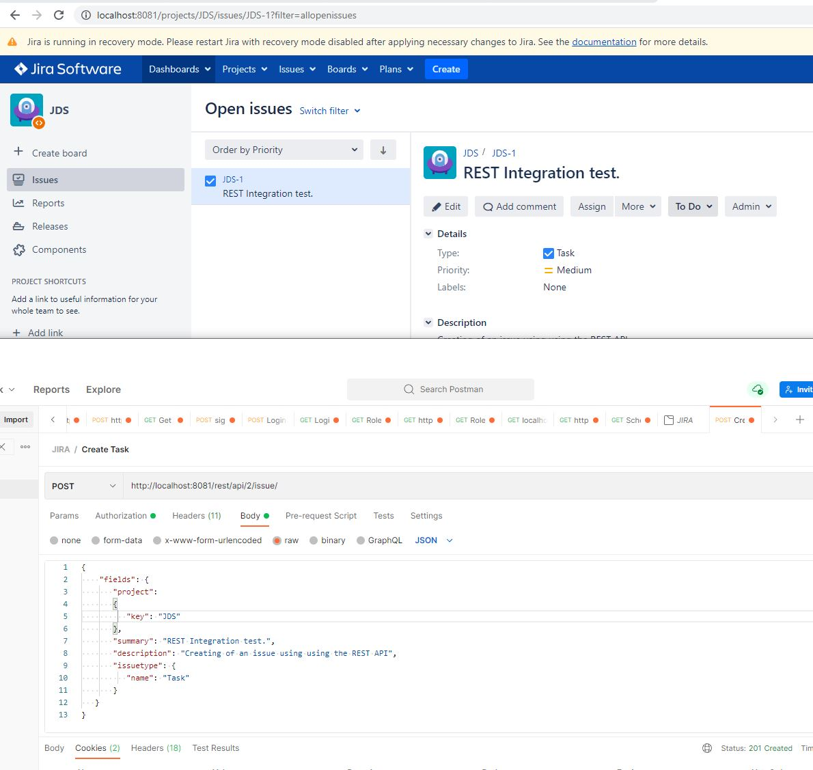
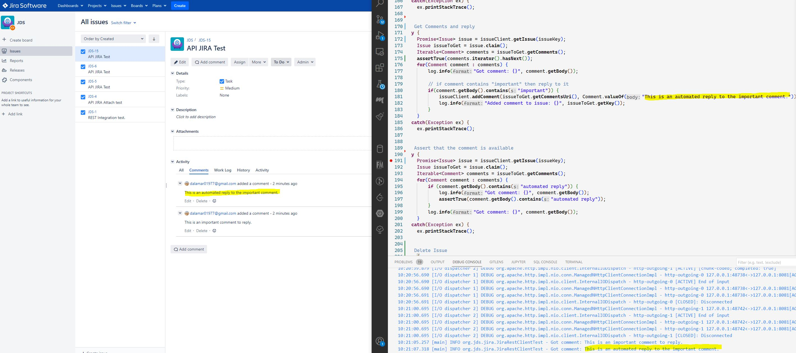
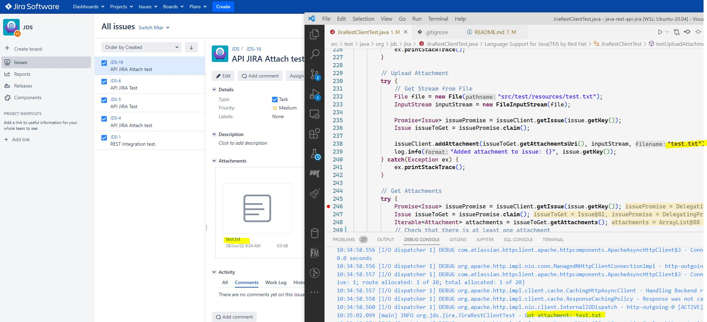

# JIRA REST API integration
Examples and API Integration with Jira by using the Java API. 

## Install JIRA

The quickest way to have JIRA up and running is to use their Docker image:

```bash
docker run -v jiraVolume:/var/atlassian/application-data/jira --name="jira" -p 8081:8080 atlassian/jira-software
```

I'm using port 8081 for this as my core API is running on 8080.

Before running the test cases, you need to create a project in Jira server.
You can use the following command to create a project:
```bash
curl -u admin:admin -X POST -H "Content-Type:application/json" -d '{"key":"JDS", "name":"JDS","projectTypeKey":"business", "lead":"admin"}' http://localhost:8081/rest/api/2/project
```

And you need to create an issue type in Jira server.
You can use the following command to create a issue type:
```bash
curl -u admin:admin -X POST -H "Content-Type:application/json" -d '{"name":"Task","description":"A Task."}' http://localhost:8081/rest/api/2/issuetype
```

Now you just need to go to postman and create a **POST** request to the URL *http://localhost:8081/rest/api/2/issue/*:

With headers:
- **Basic Authentication**: user/password
- **Header**: Content-Type : application/json

And body:
```json
{
    "fields": {
       "project":
       {
          "key": "JDS"
       },
       "summary": "REST Integration test.",
       "description": "Creating of an issue using using the REST API",
       "issuetype": {
          "name": "Task"
       }
   }
}
```

Et voila!, you have your first issue created by using JIRA's REST API.



## Dependencies

There are incompatibilities between versions of the API and the Java API might not work with the cloud version, the versions in the pom of this repo worked for me after some tweaking.

To integrate with the cloud version an option is to generate a Java API from the swagger specification.

For this example I've used an older version of the API that works fine with the latest JIRA Docker image that includes JIRA 9.X

## The Integration

My objective was to create issues, read and write comments and attach files to the issues.

Write comments, read them and reply:



JIRA doesn't have a comment reply functionality, it will be a new comment.

Attachments:


